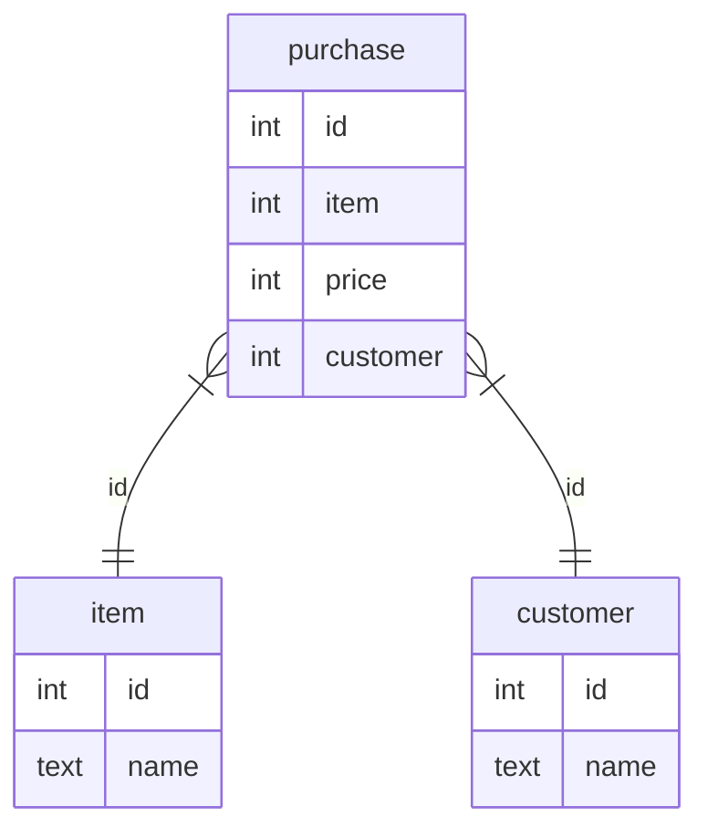

# Flakes

Language and library to create data warehouse diagrams and schemas.

## Example
This input
```
Fact purchase {
  int id -> customer.id;
  int item -> item.id;
  int price;
  int customer;
}

Dimension customer {
  int id;
  text name;
}

Dimension item {
  int id;
  text name;
}
```
will produce this output


later on the language should support the transpilation to SQL.
